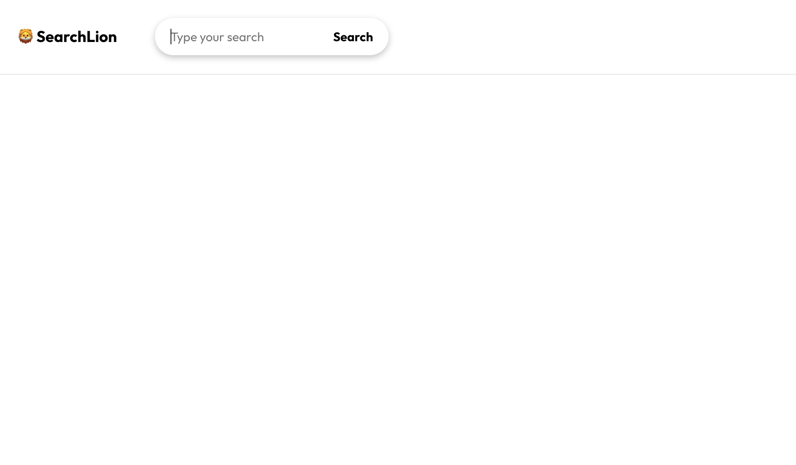
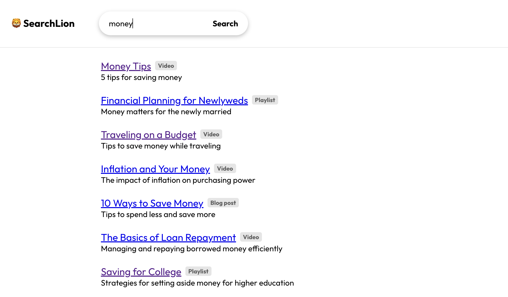
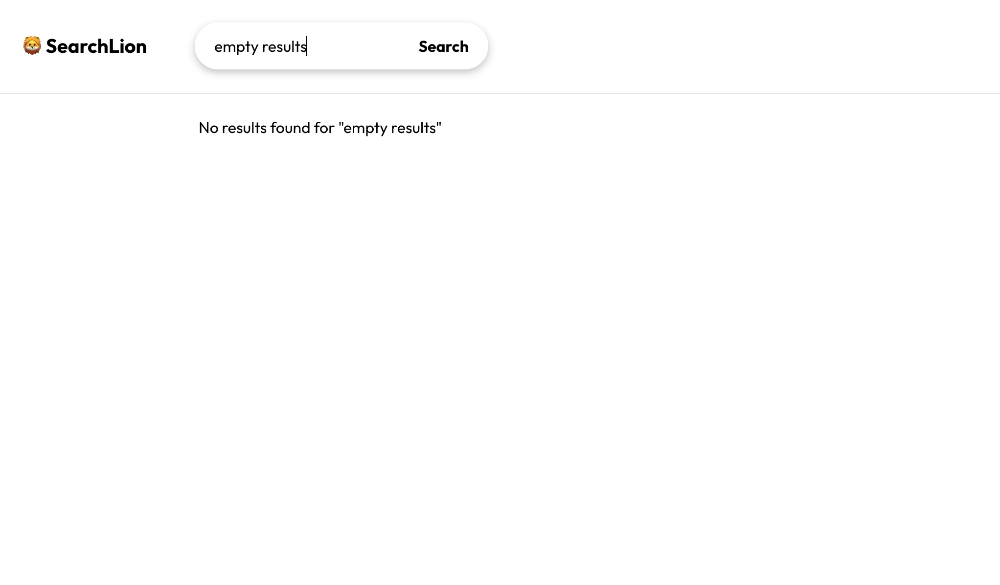

# Search UI


Welcome to the Search UI coding challenge. Feel free to check this small applicationd demonstrating my abilities in React and TypeScript.

## Usage

After you have cloned this repo, install the dependencies with:

```
npm i
```

You can then start the application by running:

```
npm start
```

Now, access [http://localhost:3000](http://localhost:3000) in your browser.

### Testing

To run the tests and check the coverage, run the following command:

```
npm run test:coverage
```

### API

- The API server is run on port `3001` while the React UI is run on port `3000`
- Your UI can call `/api/data?search=[some-query]` directly since
  the request will be proxied to `http://localhost/api/data?...`
- You will to need access the API on port `3001` if you're testing it directly
  from outside your application (e.g. http://localhost:3001/api/data?search=credit)

## The Problem

> As a consumer I want to research financial topics so I can make informed decisions.

## Requirements

```
Scenario 1
The application shall provide a search form

  Given the user visits the application
  Then a search field is displayed
  And a button is displayed with the text "Search"
```

```
Scenario 2
The search shall be triggerable by clicking the "Search" button

  Given the user has entered a search query
  When the user clicks the "Search" button
  Then matching search results are displayed
```

```
Scenario 3
The search shall be triggerable by pressing the Enter key

  Given the user has entered a search query
  And the input field is currently focused
  When the user presses the Enter key on their keyboard
  Then matching search results are displayed
```

```
Scenario 4
A loading state shall be shown while search results are loading

  Given the user has entered a search query
  When the user submits their search
  Then a loading state is shown until the search results are available
```

```
Scenario 5
Search results shall show result title and description

  Given a user has performed a search
  When search results are displayed
  Then the title and description of each search result are displayed
```

```
Scenario 6
Clicking a search result shall open its URLs in a new tab

  Given search results are displayed
  When search result is clicked
  Then the URL of the search result is opened in a new tab
```

```
Scenario 7
Search results shall be marked as their content type

  Given search results are displayed
  Then each result is clearly marked for the end user as a video, a playlist, or a blog post in a readable way
```

```
Scenario 8
The user shall be informed if no search results match their query

  Given the user has performed a search
  When there are no results matching their search query
  Then the message "There are no results matching your query." is displayed
```

## Screenshots

### Initial screen



### Search results



### Empty results


